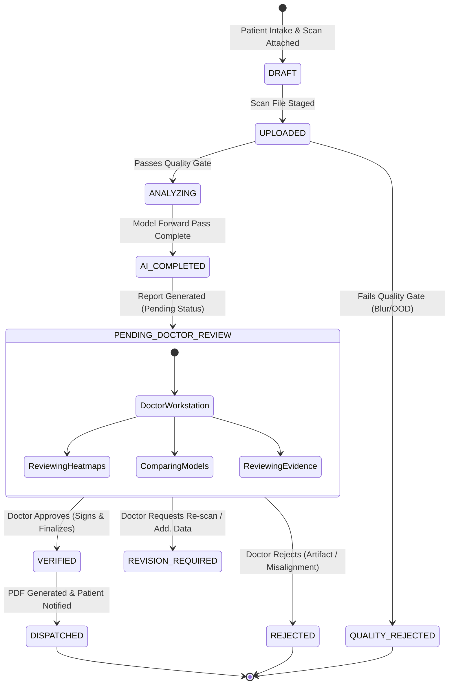

# MedVisionAI Doctor Verification Gate & Workstation Workflow

## Overview

AI models in MedVisionAI function exclusively as assistive clinical decision-support tools. **Under no circumstances does an AI model communicate directly with, or deliver unverified diagnoses to, a patient.** The Doctor Verification Gate is a mandatory human-in-the-loop checkpoint where an authorized ophthalmologist reviews, confirms, modifies, or rejects AI findings before a diagnostic report can be generated or delivered.

---

## Report Lifecycle State Machine

### State Definitions:
1. **`DRAFT` / `UPLOADED`**: Scan uploaded by clinician, pre-screening metadata gathered.
2. **`QUALITY_REJECTED`**: Scan rejected by `ImageQualityGate` due to severe blur, poor illumination, or invalid boundaries. Clinician instructed to retake scan.
3. **`ANALYZING` / `AI_COMPLETED`**: Disease adapter executes inference, runs temperature calibration, generates Grad-CAM explainability maps, and queries RAG clinical guidelines.
4. **`PENDING_DOCTOR_REVIEW`**: Report enters the Doctor Review Workstation queue (`GET /api/v1/reports/doctor/queue`). AI predictions are visible only to clinicians and doctors.
5. **`VERIFIED`**: Doctor verifies the diagnosis, adds clinical observations, management plan, and follow-up interval. Triggers the secure email dispatch to the patient.
6. **`REJECTED`**: Doctor rejects the scan due to clinical reasons (e.g. non-diagnostic artifact, incorrect laterality). Patient is not notified of erroneous findings.
7. **`REVISION_REQUIRED`**: Doctor requests additional clinical data (e.g., OCT scan, intraocular pressure measurement, repeat refraction).

---

## Doctor Review Workstation Interface (`/doctor`)

The Doctor Workstation provides an all-in-one clinical cockpit divided into four diagnostic panes:

### Pane 1: Review Queue & Case Selection
- Filterable case queue sorting pending cases by urgency (e.g., Proliferative DR, Center-Involving DME, Stage 3 ROP highlighted in red/amber alerts).
- Summarizes patient identity, age, eye laterality (OD/OS), submitted disease, and quality score.

### Pane 2: Imaging & Anatomical Explainability (Grad-CAM)
- High-resolution side-by-side or tabbed viewer displaying the original retinal/anterior scan and the Captum Grad-CAM attention heatmap.
- Visual lesion indicators identifying high-importance regions (microaneurysms, hemorrhages, cup-to-disc boundary, foveal cysts).

### Pane 3: Multi-Model Consensus & Discrepancy Analysis
- Compares the primary validated model (e.g., `dr_efficientnet_b0`, AUROC 0.948) against secondary foundation backbones (e.g., `open_eye_dr_foundation`, AUROC 0.974).
- Highlights model consensus vs. diagnostic divergence, enabling the physician to arbitrate borderline cases.

### Pane 4: Evidence, RAG Guidelines & Verification Form
- **Clinical Evidence (RAG)**: Automatically pulls clinical guidelines (e.g. AAO Preferred Practice Pattern for Diabetic Retinopathy) and differential diagnoses.
- **Doctor Findings Input**: Standardized dropdown or free-text allowing the physician to agree with the AI prediction or override with a revised diagnosis.
- **Clinical Notes & Management Plan**: Specific instructions (e.g., "Schedule panretinal photocoagulation within 2 weeks; maintain HbA1c < 7.0%").
- **Verification Actions**:
  - `Verify & Publish`: Finalizes report, updates status to `VERIFIED`, and triggers patient notification.
  - `Reject Case`: Rejects scan with recorded clinical rationale.
  - `Request Revision`: Returns report to clinician queue for supplementary testing.
